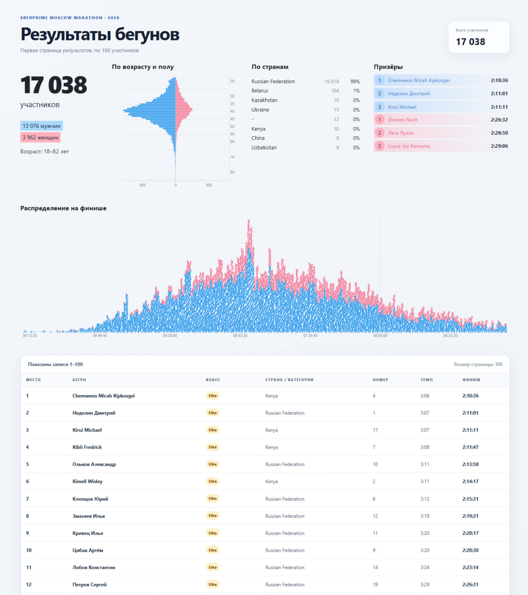

# Moscow Marathon 2026 Dashboard

Интерактивный дашборд результатов **SberPrime Moscow Marathon 2026**.

Проект показывает статистику участников марафона и подробную таблицу результатов. Дашборд построен на чистом HTML/CSS/JavaScript с использованием библиотек [Vue.js](https://vuejs.org/) и [D3.js](https://d3js.org/).

## Возможности

- сводка по общему количеству участников;
- распределение участников по полу и возрасту;
- tooltip с количеством спортсменов при наведении на возрастную диаграмму;
- рейтинг стран с количеством и долей участников;
- топ-3 мужчин и женщин по времени финиша;
- распределение финишей по времени;
- цветная отметка для каждого спортсмена на графике финишей;
- сортировка финишеров внутри каждой минуты по полу и возрасту;
- tooltip с именем, возрастом, полом, стартовым номером и временем финиша;
- таблица результатов с первыми 100 участниками.

## Технологии

- HTML5
- CSS3
- JavaScript
- Vue.js 3 — управление состоянием страницы и вывод таблицы;
- D3.js 7 — построение графиков;
- JSON — источник данных о результатах.

## Запуск

Проект не требует сборки и установки зависимостей. Для загрузки `results.json` нужен локальный HTTP-сервер.

### Python

```bash
python -m http.server 8000
```

После этого откройте в браузере:

```text
http://localhost:8000
```

### Windows PowerShell

Откройте PowerShell в папке проекта:

```powershell
cd C:\Users\maria\Downloads\mm2026
python -m http.server 8000
```

## Структура проекта

```text
mm2026/
├── index.html       # разметка страницы
├── styles.css       # стили и адаптивная вёрстка
├── app.js           # Vue-приложение и D3-графики
├── results.json     # результаты участников
├── elite.html       # исходные данные элитного забега
├── amateurs.html    # исходные данные любительского забега
└── README.md        # описание проекта
```

## Данные

Файл `results.json` содержит 17 038 записей. Для каждой записи доступны:

- место;
- имя спортсмена;
- страна и возрастная категория;
- стартовый номер;
- темп;
- время финиша;
- класс участника: `elite` или `amateur`.

Возраст и пол извлекаются из поля страны/категории, например:

```text
Russian Federation, M34
```

## Добавление скриншота в README

Чтобы добавить снимок дашборда в репозиторий:

1. Откройте `http://localhost:8000`.
2. Сделайте снимок экрана и сохраните его в папку проекта под именем:

   ```text
   dashboard-preview.png
   ```

3. Добавьте в конец этого файла:

   ```markdown
   ## Превью

   
   ```

4. Отправьте файл на GitHub:

   ```powershell
   git add README.md dashboard-preview.png
   git commit -m "Add dashboard README and preview"
   git push
   ```

После этого изображение будет отображаться прямо на главной странице репозитория GitHub.
